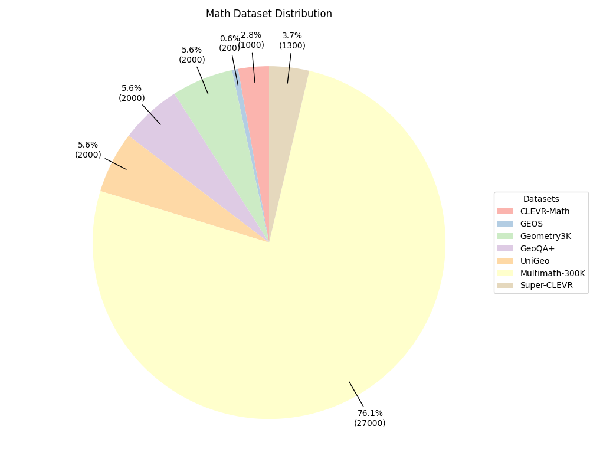
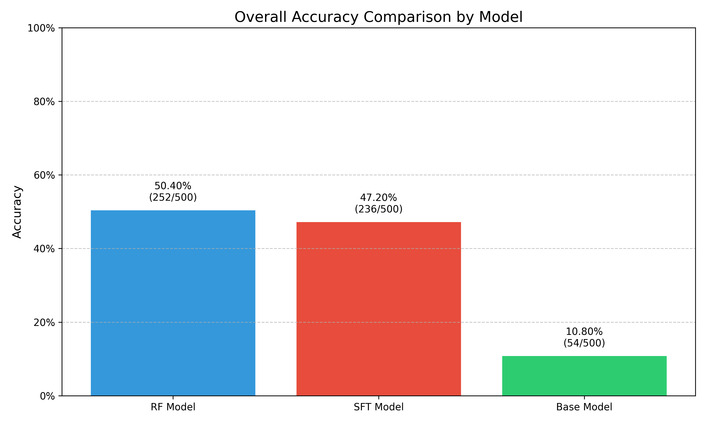
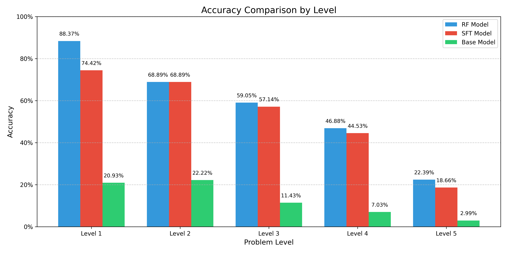

# 📐 Small-Math-R1: A Lightweight Math Reasoning Model

## 👥 Authors

* **Jaegun Lee** ([leejken530@knu.ac.kr](mailto:leejken530@knu.ac.kr))
* **Janghoon Choi** ([jhchoi09@knu.ac.kr](mailto:jhchoi09@knu.ac.kr))
  Graduate School of Data Science, Kyungpook National University

[📖 Paper](/src/paper/small_r1_paper6_final.pdf) 
this paper is accepted by KCC(Korea Computer Congress) 

## 📌 Overview

**Small-Math-R1** is a lightweight visual-language model fine-tuned specifically for **math reasoning tasks**. We leverage the compact yet powerful [Qwen2.5-VL 3B](https://huggingface.co/Qwen/Qwen2.5-3B) model as the base and enhance its reasoning ability using **Supervised Fine-Tuning (SFT)** and **Reinforcement Learning (Adjusted GRPO)**.

This model is designed to handle both **multiple choice** and **numeric reasoning** tasks across various subdomains of mathematics, with a particular emphasis on **multimodal visual reasoning** using diagrams and synthetic images.


## 📊 Dataset Composition

We curated a mixture of math-focused datasets totaling **\~37.5k samples**, covering areas such as geometry, symbolic arithmetic, and multimodal reasoning. Below is a breakdown of the datasets used:

| Dataset Name       | Type     | Size | Description                                                                |
| ------------------ | -------- | ---- | -------------------------------------------------------------------------- |
| **CLEVR-Math**     | `num`    | 1k   | CLEVR-style synthetic visual math questions requiring numerical reasoning. |
| **GEOS**           | `mc`     | 0.2k | Geometry-based multiple choice questions parsed from GEOS symbolic solver. |
| **Geometry3K**     | `mc`     | 2k   | Middle/high school geometry MCQs.                                          |
| **GeoQA+**         | `mc`     | 2k   | Map-based visual questions including spatial and geometry-based QA.        |
| **UniGeo**         | `mc`     | 2k   | Diverse multi-choice geometry problems with visual figures.                |
| **Multimath-300K** | `mc/num` | 27k  | Large-scale multimodal math dataset, includes both numeric and MC formats. |
| **Super-CLEVR**    | `num`    | 1.3k | An advanced version of CLEVR with complex math reasoning over visuals.     |

🖼️ Dataset distribution chart:


## 🚀 Performance

We evaluated the model on **Math-500**, a benchmark for visual math problem solving.
Small-Math-R1 **outperforms the base Qwen2.5-VL model by over 40 percentage points** in overall accuracy.

* 🟢 Overall Accuracy:
  

* 🧮 Accuracy by Difficulty Level:
  


## ⚙️ Setup Instructions

```bash
# Clone the repository
git clone https://github.com/your-username/small_math_r1.git
cd small_math_r1

# Set up Python environment
conda create -n small_math_r1 python=3.11 
conda activate small_math_r1
bash setup.sh

# Optional: Enable high-speed video decoding for vision tasks
cd src/qwen-vl-utils
pip install -e .[decord]
cd ../..
```

🗃️ The dataset will be released in June 2025.
Large files will be managed using Git LFS.


## 🧠 Training Pipeline

We first perform **Supervised Fine-Tuning (SFT)** to warm-start the model:

```bash
bash src/scripts/run_sft_math.sh
```

Then, we run **Reinforcement Learning** using the **Adjusted GRPO algorithm** to further optimize reasoning capabilities:

```bash
bash src/scripts/run_grpo_math.sh
```

---

## 📬 Contact & Citation

If you use this model or codebase in your work, please cite us or contact the authors for collaboration.

